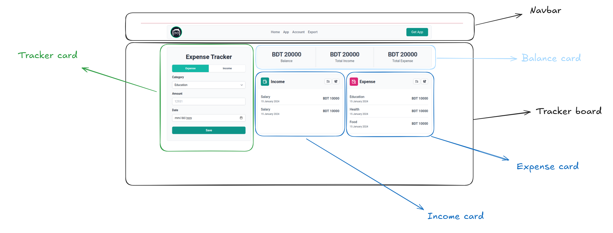

# Expense Tracker Application

An intuitive and user-friendly expense tracking application to help you manage your finances efficiently.

## Features

- 📊 Track both expenses and income
- 💰 View current balance, total income, and total expenses
- 🗂️ Categorize transactions for better organization
- 📅 Date-based transaction logging
- 📱 Responsive design for all devices

## Components

1. **Navbar**

   - Navigation menu: Home, App, Account, Export
   - "Get App" button

2. **Tracker Board**

   - Tracker Card: Insert and Update new expenses or incomes
   - Balance Card: Current Balance, Total Income, Total Expenses
   - Income Card: Lists recent income entries
   - Expense Card: Lists recent expense entries with categories

3. **Tracker Card**

   - Form for entering new expenses or income
   - Fields: Category, Amount, Date

4. **Balance Card**

   - Displays: Current Balance, Total Income, Total Expenses

5. **Income Card**

   - Lists recent income entries

6. **Expense Card**

   - Lists recent expense entries with categories

## Technologies Used

- HTML5
- CSS3
- JavaScript
- React (Vite)
- Tailwind CSS

## Getting Started

### Prerequisites

- Node.js
- npm

### Installation

1. Clone the repository
2. Navigate to the project directory
3. Install dependencies
4. Start the development server
5. Open your browser and visit `http://localhost:5173`

## Usage

1. Use the Tracker Card to add new income or expenses.
2. Select a category, enter the amount, and choose a date.
3. Click 'Save' to record the transaction.
4. View your financial overview in the Balance Card.
5. Check recent transactions in the Tracker Board.
6. Use the delete and edit button locate at Income Card to remove and update transactions.

## License

Distributed under the MIT License. See `LICENSE` for more information.

## Contact

Md Abdul Aziz - [@abdulazizfahad](https://www.linkedin.com/in/abdulazizfahad/) - <abdulazizbd17@gmail.com>

Project Link: [https://github.com/abdulaziz-bd/expense-tracker](https://github.com/abdulaziz-bd/expense-tracker)
